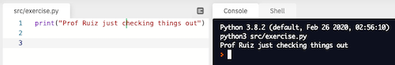

# Lesson 7 Programming Assignment


> [Crumbl](https://crumblcookies.com/) needs your help with some of their pressing business issues! But before you can write the software they need, you need to practice your  programming skills.
>
> They've promised you free cookies...

## Objectives
- Practice the programming skills you've learned in this lesson,
- Learn how to submit and update your programming assignments via GitHub, and
- Experience how a rubric will be used to grade your programming assignments.

## Directions
1. Design a program that:
    - Has a comment that indicates this is Lesson 7 Programming Assignment
    - Displays your full name to the console/shell
    - Calculates and displays the number of items in eight dozen
    - Calculates and displays the number of weeks in 180 days, as a whole number (truncated)
<br><br>    
2. Test your program by running it and examining the output. Fix any errors that occur. Your output in the shell/console should match the example below:

```
Jane Doe
96
25
```


## GitHub Submission
> This [instructional video](https://youtu.be/gdc-SYhRFCM) will walk you through this process step-by-step
1. Open the **GitHub Invitation URL** in your Canvas assignment.
2. Read the directions above very carefully.
3. Right click the **work in replit** button near the top of this page, and select "open in new tab".
4. Once in replit, in the left-most menu, open the **Files** menu, open the **src** folder, then open the ```exercise.py``` file.
5. Begin coding your solution.
6. In the left-most menu, open the **Version Control** menu, make a note in the text box, then click the **commit/push** button.
7. Toggle this GitHub window side by side with the replit window.
8. Here in Github, open the **Pull Requests** tab above, then open the **Feedback** option.
9. Once your submission has processed, two bots will begin outlining errors in your program that need to be fixed.
    - **RuizTheRuler-bot** will point out syntax and style errors
    - **Github Actions Bot** will point out logic and formatting errors.
10. Fix the errors pointed out by the bots, re-submit your program, then wait for the bots to scan your program again.
    - This is an iterative process; it may take several repetitions before all errors are fixed.
11. Once **Github Actions Bot** tells you your program is error free, you've completed your assignment. Good job!

## Replit Run Button 
Occasionally, the Repl.it run button will not work. If this happens to you, manually run your file by typing ```python3 src/exercise.py``` at the prompt in the console:


